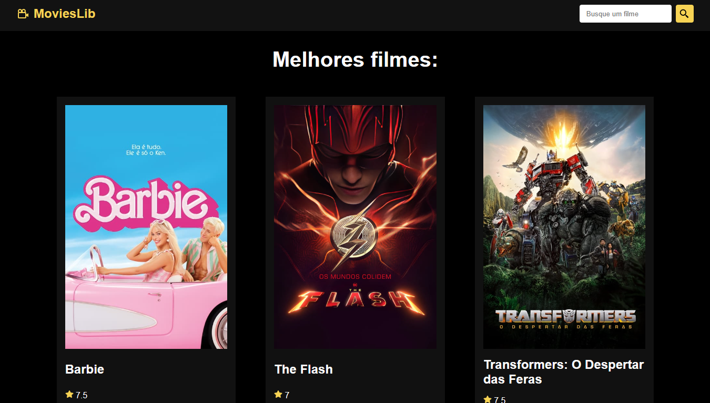

# React + Vite

Projeto usando a API do site The Movie Database - [www.themoviedb.org](https://www.themoviedb.org)

Créditos:  
[Matheus Battisti](https://github.com/matheusbattisti)
 
Link do projeto desenvolvido no canal [Hora de Codar](https://www.youtube.com/watch?v=XqxUHVVO7-U)

